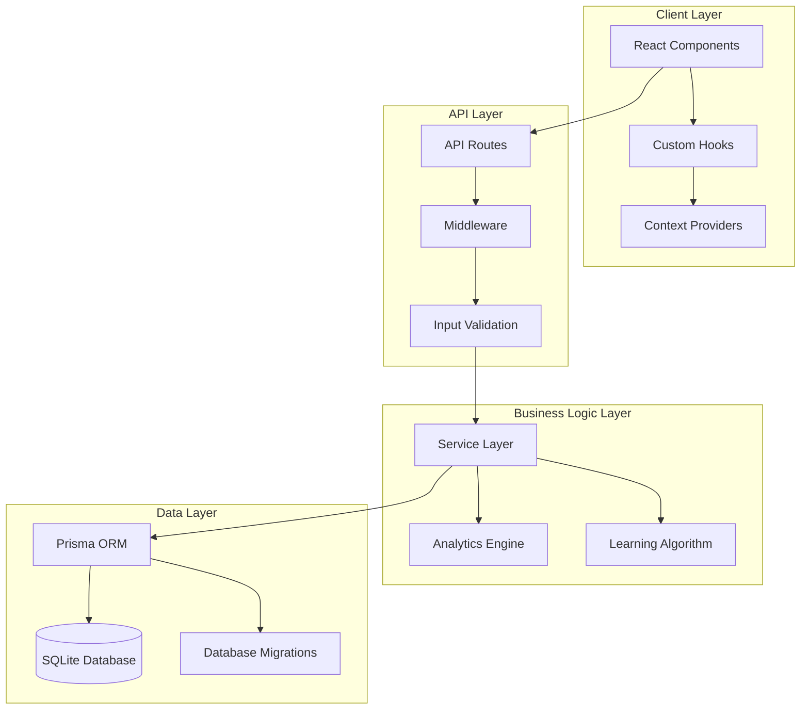
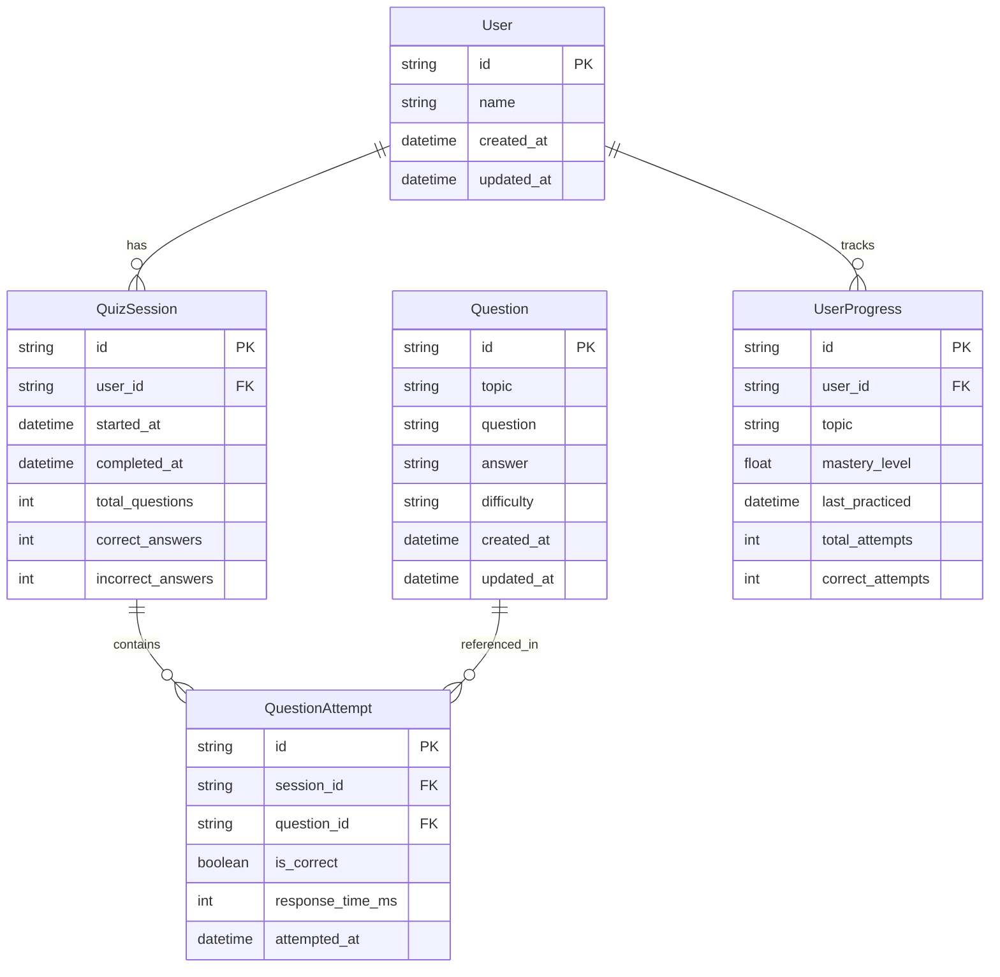

# Design Document

## Overview

This design document outlines the architectural improvements for the FlashTest application, transforming it from a simple file-based system to a robust, scalable, and maintainable learning platform. The design focuses on implementing proper data persistence, improving code organization, enhancing user experience, and establishing comprehensive testing and quality assurance practices.

## Architecture

### High-Level Architecture



### Database Schema Design



## Components and Interfaces

### Core Components Refactoring

#### 1. Quiz Session Management Hook
```typescript
interface QuizSessionState {
  questions: Question[];
  currentIndex: number;
  isFlipped: boolean;
  sessionAnsweredCount: number;
  correctAnswers: string[];
  incorrectAnswers: string[];
  isLoading: boolean;
  error: string | null;
}

interface QuizSessionActions {
  flipCard: () => void;
  answerQuestion: (isCorrect: boolean) => Promise<void>;
  nextQuestion: () => void;
  resetSession: () => void;
  loadQuestions: () => Promise<void>;
}

const useQuizSession = (): QuizSessionState & QuizSessionActions;
```

#### 2. Component Hierarchy Restructure
```
HomePage
├── QuizContainer
│   ├── QuizHeader
│   │   ├── Logo
│   │   └── ActionButtons
│   ├── QuizProgress
│   └── QuizContent
│       ├── FlashCard
│       └── QuizControls
└── PerformanceAnalysisDialog
```

#### 3. Service Layer Architecture
```typescript
interface QuestionService {
  getAllQuestions(): Promise<Question[]>;
  addQuestion(question: CreateQuestionDto): Promise<Question>;
  updateQuestion(id: string, question: UpdateQuestionDto): Promise<Question>;
  deleteQuestion(id: string): Promise<void>;
}

interface AnalyticsService {
  recordQuestionAttempt(attempt: QuestionAttemptDto): Promise<void>;
  getPerformanceAnalysis(userId: string): Promise<PerformanceAnalysis>;
  getUserProgress(userId: string): Promise<UserProgress[]>;
}

interface LearningService {
  getNextQuestions(userId: string, count: number): Promise<Question[]>;
  updateMasteryLevel(userId: string, topic: string, performance: number): Promise<void>;
}
```

### API Design

#### RESTful API Endpoints
```typescript
// Questions API
GET    /api/questions              // Get all questions
POST   /api/questions              // Create new question
PUT    /api/questions/:id          // Update question
DELETE /api/questions/:id          // Delete question

// Quiz Sessions API
POST   /api/quiz/sessions          // Start new quiz session
PUT    /api/quiz/sessions/:id      // Update session
GET    /api/quiz/sessions/:id      // Get session details

// Analytics API
POST   /api/analytics/attempts     // Record question attempt
GET    /api/analytics/performance  // Get performance analysis
GET    /api/analytics/progress     // Get user progress

// User API
GET    /api/users/profile          // Get user profile
PUT    /api/users/profile          // Update user profile
```

#### Error Response Format
```typescript
interface ApiError {
  success: false;
  error: {
    code: string;
    message: string;
    details?: Record<string, any>;
  };
  timestamp: string;
  path: string;
}

interface ApiSuccess<T> {
  success: true;
  data: T;
  timestamp: string;
}
```

## Data Models

### Database Models with Prisma

```prisma
model Question {
  id          String   @id @default(cuid())
  topic       String
  question    String
  answer      String
  difficulty  String   @default("medium")
  createdAt   DateTime @default(now())
  updatedAt   DateTime @updatedAt
  attempts    QuestionAttempt[]
  
  @@map("questions")
}

model User {
  id          String   @id @default(cuid())
  name        String?
  email       String?  @unique
  createdAt   DateTime @default(now())
  updatedAt   DateTime @updatedAt
  sessions    QuizSession[]
  progress    UserProgress[]
  
  @@map("users")
}

model QuizSession {
  id              String   @id @default(cuid())
  userId          String?
  startedAt       DateTime @default(now())
  completedAt     DateTime?
  totalQuestions  Int      @default(0)
  correctAnswers  Int      @default(0)
  incorrectAnswers Int     @default(0)
  user            User?    @relation(fields: [userId], references: [id])
  attempts        QuestionAttempt[]
  
  @@map("quiz_sessions")
}

model QuestionAttempt {
  id             String      @id @default(cuid())
  sessionId      String
  questionId     String
  isCorrect      Boolean
  responseTimeMs Int?
  attemptedAt    DateTime    @default(now())
  session        QuizSession @relation(fields: [sessionId], references: [id])
  question       Question    @relation(fields: [questionId], references: [id])
  
  @@map("question_attempts")
}

model UserProgress {
  id             String   @id @default(cuid())
  userId         String
  topic          String
  masteryLevel   Float    @default(0.0)
  lastPracticed  DateTime @default(now())
  totalAttempts  Int      @default(0)
  correctAttempts Int     @default(0)
  user           User     @relation(fields: [userId], references: [id])
  
  @@unique([userId, topic])
  @@map("user_progress")
}
```

### TypeScript Interfaces

```typescript
interface Question {
  id: string;
  topic: string;
  question: string;
  answer: string;
  difficulty: 'easy' | 'medium' | 'hard';
  createdAt: Date;
  updatedAt: Date;
}

interface QuizSession {
  id: string;
  userId?: string;
  startedAt: Date;
  completedAt?: Date;
  totalQuestions: number;
  correctAnswers: number;
  incorrectAnswers: number;
  attempts: QuestionAttempt[];
}

interface PerformanceAnalysis {
  overallAccuracy: number;
  topicBreakdown: TopicPerformance[];
  weakAreas: string[];
  recommendations: string[];
  improvementTrends: TrendData[];
}

interface SpacedRepetitionData {
  questionId: string;
  easeFactor: number;
  interval: number;
  repetitions: number;
  nextReviewDate: Date;
}
```

## Error Handling

### Error Boundary Implementation
```typescript
interface ErrorBoundaryState {
  hasError: boolean;
  error?: Error;
  errorInfo?: ErrorInfo;
}

class AppErrorBoundary extends Component<PropsWithChildren, ErrorBoundaryState> {
  // Comprehensive error boundary with logging and recovery options
}
```

### API Error Handling Strategy
```typescript
interface ErrorHandlingMiddleware {
  // Global error handler for API routes
  handleApiError(error: unknown, req: NextRequest): NextResponse;
  
  // Validation error handler
  handleValidationError(error: ZodError): ApiError;
  
  // Database error handler
  handleDatabaseError(error: PrismaClientKnownRequestError): ApiError;
}
```

### Client-Side Error Handling
```typescript
interface ErrorRecoveryStrategies {
  // Retry mechanism for failed requests
  retryWithBackoff<T>(fn: () => Promise<T>, maxRetries: number): Promise<T>;
  
  // Offline handling
  handleOfflineState(): void;
  
  // Graceful degradation
  provideFallbackExperience(): void;
}
```

## Testing Strategy

### Testing Pyramid Structure

#### Unit Tests (70%)
- Custom hooks testing with React Testing Library
- Service layer testing with mocked dependencies
- Utility function testing
- Component testing in isolation

#### Integration Tests (20%)
- API endpoint testing with test database
- Database operation testing
- Component integration testing
- State management testing

#### End-to-End Tests (10%)
- Critical user flow testing with Playwright
- Cross-browser compatibility testing
- Performance testing
- Accessibility testing

### Test Configuration
```typescript
// Jest configuration for comprehensive testing
interface TestConfig {
  setupFiles: string[];
  testEnvironment: 'jsdom' | 'node';
  coverageThreshold: {
    global: {
      branches: 80;
      functions: 80;
      lines: 80;
      statements: 80;
    };
  };
}
```

### Mock Strategy
```typescript
// Comprehensive mocking strategy
interface MockingStrategy {
  // Database mocking for unit tests
  mockPrismaClient(): PrismaClient;
  
  // API mocking for component tests
  mockApiResponses(): MockedApiClient;
  
  // External service mocking
  mockExternalServices(): MockedServices;
}
```

## Performance Optimizations

### Client-Side Optimizations
- React.memo for expensive components
- useMemo and useCallback for expensive computations
- Virtual scrolling for large question lists
- Image optimization and lazy loading
- Code splitting and dynamic imports

### Server-Side Optimizations
- Database query optimization with proper indexing
- Response caching for frequently accessed data
- Connection pooling for database connections
- Compression middleware for API responses

### Bundle Optimization
```typescript
// Next.js configuration for optimal bundling
const nextConfig = {
  experimental: {
    optimizeCss: true,
    optimizePackageImports: ['lucide-react', '@radix-ui/react-*']
  },
  compiler: {
    removeConsole: process.env.NODE_ENV === 'production'
  }
};
```

## Security Considerations

### Input Validation and Sanitization
```typescript
// Comprehensive validation schemas
const CreateQuestionSchema = z.object({
  topic: z.string().min(2).max(50).trim(),
  question: z.string().min(10).max(500).trim(),
  answer: z.string().min(1).max(200).trim(),
  difficulty: z.enum(['easy', 'medium', 'hard']).optional()
});
```

### Rate Limiting Strategy
```typescript
interface RateLimitConfig {
  windowMs: number;
  maxRequests: number;
  skipSuccessfulRequests: boolean;
  standardHeaders: boolean;
}

// Different limits for different endpoints
const rateLimits = {
  general: { windowMs: 15 * 60 * 1000, maxRequests: 100 },
  addQuestion: { windowMs: 60 * 1000, maxRequests: 5 },
  analytics: { windowMs: 60 * 1000, maxRequests: 20 }
};
```

### Data Protection
- SQL injection prevention through parameterized queries
- XSS prevention through proper input sanitization
- CSRF protection for state-changing operations
- Secure headers configuration

## Accessibility Implementation

### WCAG 2.1 AA Compliance
- Proper semantic HTML structure
- ARIA labels and descriptions
- Keyboard navigation support
- Color contrast compliance
- Screen reader optimization

### Keyboard Navigation
```typescript
interface KeyboardShortcuts {
  'Space': 'flipCard';
  'ArrowRight': 'markCorrect';
  'ArrowLeft': 'markIncorrect';
  'Enter': 'nextQuestion';
  'Escape': 'resetSession';
}
```

### Focus Management
- Proper focus trapping in modals
- Focus restoration after interactions
- Skip links for navigation
- Focus indicators for all interactive elements

## Deployment and DevOps

### Environment Configuration
```typescript
interface EnvironmentConfig {
  DATABASE_URL: string;
  NEXTAUTH_SECRET: string;
  GOOGLE_AI_API_KEY: string;
  NODE_ENV: 'development' | 'production' | 'test';
  LOG_LEVEL: 'debug' | 'info' | 'warn' | 'error';
}
```

### Database Migration Strategy
- Automated migrations with Prisma
- Rollback capabilities
- Data seeding for development
- Backup strategies for production

### Monitoring and Logging
```typescript
interface MonitoringConfig {
  errorTracking: 'sentry' | 'bugsnag';
  performanceMonitoring: boolean;
  userAnalytics: boolean;
  serverLogging: {
    level: string;
    format: 'json' | 'text';
    destinations: string[];
  };
}
```

This design provides a comprehensive foundation for transforming the FlashTest application into a robust, scalable, and maintainable learning platform while addressing all the requirements outlined in the requirements document.